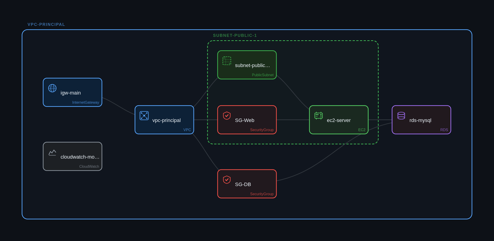

# webapp-infraplot
Web App Básico com SecurityGroups

## Description

Crie uma arquitetura de aplicação web básica com: VPC "main_vpc" (10.0.0.0/16) conectada a um InternetGateway "igw_main"; PublicSubnet "public_subnet_1" (10.0.1.0/24) contendo dois EC2 "web_server_1" e "web_server_2" instâncias t3.micro; PrivateSubnet "private_subnet_1" (10.0.2.0/24) contendo RDS MySQL "db_instance" db.t3.micro multi_az false backup_retention 7; SecurityGroup "SG_Web" com regras de entrada nas portas 80 (HTTP) e 443 (HTTPS) de 0.0.0.0/0 conectado aos EC2; SecurityGroup "SG_DB" com regra de entrada na porta 3306 apenas a partir do CIDR 10.0.0.0/8 conectado ao RDS; CloudWatch "web_monitoring" coletando métricas de CPU, StatusCheckFailed e NetworkIn dos EC2 e ConnectionCount do RDS. Conecte: InternetGateway à VPC; EC2 ao RDS; CloudWatch aos EC2 e ao RDS.

## Architecture

infrapilot-diagram.png


## Requirements

No requirements.

## Providers

No providers.

## Modules

No modules.

## Resources

No resources.

## Inputs

No inputs.

## Outputs

No outputs.
## Requirements

No requirements.

## Providers

No providers.

## Modules

| Name | Source | Version |
| ---- | ------ | ------- |
| <a name="module_cw1"></a> [cw1](#module\_cw1) | ./modules/cw1 | n/a |
| <a name="module_db1"></a> [db1](#module\_db1) | ./modules/db1 | n/a |
| <a name="module_ec1"></a> [ec1](#module\_ec1) | ./modules/ec1 | n/a |
| <a name="module_igw1"></a> [igw1](#module\_igw1) | ./modules/igw1 | n/a |
| <a name="module_sg_db"></a> [sg\_db](#module\_sg\_db) | ./modules/sg_db | n/a |
| <a name="module_sg_web"></a> [sg\_web](#module\_sg\_web) | ./modules/sg_web | n/a |
| <a name="module_sn_pub_1"></a> [sn\_pub\_1](#module\_sn\_pub\_1) | ./modules/sn_pub_1 | n/a |
| <a name="module_v1"></a> [v1](#module\_v1) | ./modules/v1 | n/a |

## Resources

No resources.

## Inputs

| Name | Description | Type | Default | Required |
| ---- | ----------- | ---- | ------- | :------: |
| <a name="input_aws_region"></a> [aws\_region](#input\_aws\_region) | n/a | `string` | `"us-east-1"` | no |
| <a name="input_db_engine"></a> [db\_engine](#input\_db\_engine) | n/a | `string` | `"mysql"` | no |
| <a name="input_environment"></a> [environment](#input\_environment) | n/a | `string` | `"dev"` | no |
| <a name="input_instance_class"></a> [instance\_class](#input\_instance\_class) | n/a | `string` | `"db.t3.micro"` | no |
| <a name="input_instance_type"></a> [instance\_type](#input\_instance\_type) | n/a | `string` | `"t3.micro"` | no |
| <a name="input_multi_az"></a> [multi\_az](#input\_multi\_az) | n/a | `bool` | `false` | no |
| <a name="input_use_spot"></a> [use\_spot](#input\_use\_spot) | n/a | `bool` | `false` | no |

## Outputs

No outputs.

```bash

Terraform used the selected providers to generate the following execution
plan. Resource actions are indicated with the following symbols:
  + create

Terraform will perform the following actions:

  # module.cw1.aws_cloudwatch_log_group.this will be created
  + resource "aws_cloudwatch_log_group" "this" {
      + arn                         = (known after apply)
      + deletion_protection_enabled = (known after apply)
      + id                          = (known after apply)
      + log_group_class             = (known after apply)
      + name                        = "/aws/app/default-cloudwatch_monitoring"
      + name_prefix                 = (known after apply)
      + region                      = "us-east-1"
      + retention_in_days           = 7
      + skip_destroy                = false
      + tags                        = {
          + "Environment" = "default"
          + "Name"        = "default-cloudwatch_monitoring"
        }
      + tags_all                    = {
          + "Environment" = "default"
          + "Name"        = "default-cloudwatch_monitoring"
        }
    }

  # module.cw1.aws_cloudwatch_metric_alarm.this will be created
  + resource "aws_cloudwatch_metric_alarm" "this" {
      + actions_enabled                       = true
      + alarm_description                     = "Alarm for default-cloudwatch_monitoring"
      + alarm_name                            = "default-cloudwatch_monitoring-alarm"
      + arn                                   = (known after apply)
      + comparison_operator                   = "GreaterThanOrEqualToThreshold"
      + evaluate_low_sample_count_percentiles = (known after apply)
      + evaluation_periods                    = 2
      + id                                    = (known after apply)
      + metric_name                           = "CPUUtilization"
      + namespace                             = "AWS/EC2"
      + period                                = 300
      + region                                = "us-east-1"
      + statistic                             = "Average"
      + tags                                  = {
          + "Environment" = "default"
          + "Name"        = "default-cloudwatch_monitoring-alarm"
        }
      + tags_all                              = {
          + "Environment" = "default"
          + "Name"        = "default-cloudwatch_monitoring-alarm"
        }
      + threshold                             = 80
      + treat_missing_data                    = "missing"
    }

  # module.db1.aws_db_instance.this will be created
  + resource "aws_db_instance" "this" {
      + address                               = (known after apply)
      + allocated_storage                     = 20
      + apply_immediately                     = false
      + arn                                   = (known after apply)
      + auto_minor_version_upgrade            = true
      + availability_zone                     = (known after apply)
      + backup_retention_period               = 7
      + backup_target                         = (known after apply)
      + backup_window                         = "03:00-04:00"
      + ca_cert_identifier                    = (known after apply)
      + character_set_name                    = (known after apply)
      + copy_tags_to_snapshot                 = false
      + database_insights_mode                = (known after apply)
      + db_name                               = (known after apply)
      + db_subnet_group_name                  = (known after apply)
      + dedicated_log_volume                  = false
      + delete_automated_backups              = true
      + deletion_protection                   = false
      + domain_fqdn                           = (known after apply)
      + endpoint                              = (known after apply)
      + engine                                = "mysql"
      + engine_lifecycle_support              = (known after apply)
      + engine_version                        = "8.0"
      + engine_version_actual                 = (known after apply)
      + hosted_zone_id                        = (known after apply)
      + id                                    = (known after apply)
      + identifier                            = "default-rds-mysql"
      + identifier_prefix                     = (known after apply)
      + instance_class                        = "db.t3.micro"
      + iops                                  = (known after apply)
      + kms_key_id                            = (known after apply)
      + latest_restorable_time                = (known after apply)
      + license_model                         = (known after apply)
      + listener_endpoint                     = (known after apply)
      + maintenance_window                    = "sun:03:00-sun:04:00"
      + master_user_secret                    = (known after apply)
      + master_user_secret_kms_key_id         = (known after apply)
      + monitoring_interval                   = 0
      + monitoring_role_arn                   = (known after apply)
      + multi_az                              = false
      + nchar_character_set_name              = (known after apply)
      + network_type                          = (known after apply)
      + option_group_name                     = (known after apply)
      + parameter_group_name                  = (known after apply)
      + password                              = (sensitive value)
      + password_wo                           = (write-only attribute)
      + performance_insights_enabled          = false
      + performance_insights_kms_key_id       = (known after apply)
      + performance_insights_retention_period = (known after apply)
      + port                                  = (known after apply)
      + publicly_accessible                   = false
      + region                                = "us-east-1"
      + replica_mode                          = (known after apply)
      + replicas                              = (known after apply)
      + resource_id                           = (known after apply)
      + skip_final_snapshot                   = true
      + snapshot_identifier                   = (known after apply)
      + status                                = (known after apply)
      + storage_throughput                    = (known after apply)
      + storage_type                          = "gp3"
      + tags                                  = {
          + "Environment" = "default"
          + "Name"        = "default-rds_mysql"
        }
      + tags_all                              = {
          + "Environment" = "default"
          + "Name"        = "default-rds_mysql"
        }
      + timezone                              = (known after apply)
      + upgrade_rollout_order                 = (known after apply)
      + username                              = "admin"
      + vpc_security_group_ids                = (known after apply)
    }

  # module.ec1.aws_iam_instance_profile.this will be created
  + resource "aws_iam_instance_profile" "this" {
      + arn         = (known after apply)
      + create_date = (known after apply)
      + id          = (known after apply)
      + name        = "profile-default-ec2_server"
      + name_prefix = (known after apply)
      + path        = "/"
      + tags_all    = (known after apply)
      + unique_id   = (known after apply)
    }

  # module.ec1.aws_iam_role.this will be created
  + resource "aws_iam_role" "this" {
      + arn                   = (known after apply)
      + assume_role_policy    = jsonencode(
            {
              + Statement = [
                  + {
                      + Action    = "sts:AssumeRole"
                      + Effect    = "Allow"
                      + Principal = {
                          + Service = "ec2.amazonaws.com"
                        }
                    },
                ]
              + Version   = "2012-10-17"
            }
        )
      + create_date           = (known after apply)
      + force_detach_policies = false
      + id                    = (known after apply)
      + managed_policy_arns   = (known after apply)
      + max_session_duration  = 3600
      + name                  = "role-default-ec2_server"
      + name_prefix           = (known after apply)
      + path                  = "/"
      + tags_all              = (known after apply)
      + unique_id             = (known after apply)

      + inline_policy (known after apply)
    }

  # module.ec1.aws_instance.this will be created
  + resource "aws_instance" "this" {
      + ami                                  = "ami-0c02fb55956c7d316"
      + arn                                  = (known after apply)
      + associate_public_ip_address          = (known after apply)
      + availability_zone                    = (known after apply)
      + disable_api_stop                     = (known after apply)
      + disable_api_termination              = false
      + ebs_optimized                        = (known after apply)
      + enable_primary_ipv6                  = (known after apply)
      + force_destroy                        = false
      + get_password_data                    = false
      + host_id                              = (known after apply)
      + host_resource_group_arn              = (known after apply)
      + iam_instance_profile                 = "profile-default-ec2_server"
      + id                                   = (known after apply)
      + instance_initiated_shutdown_behavior = (known after apply)
      + instance_lifecycle                   = (known after apply)
      + instance_state                       = (known after apply)
      + instance_type                        = "t3.micro"
      + ipv6_address_count                   = (known after apply)
      + ipv6_addresses                       = (known after apply)
      + key_name                             = (known after apply)
      + monitoring                           = false
      + outpost_arn                          = (known after apply)
      + password_data                        = (known after apply)
      + placement_group                      = (known after apply)
      + placement_group_id                   = (known after apply)
      + placement_partition_number           = (known after apply)
      + primary_network_interface_id         = (known after apply)
      + private_dns                          = (known after apply)
      + private_ip                           = (known after apply)
      + public_dns                           = (known after apply)
      + public_ip                            = (known after apply)
      + region                               = "us-east-1"
      + secondary_private_ips                = (known after apply)
      + security_groups                      = (known after apply)
      + source_dest_check                    = true
      + spot_instance_request_id             = (known after apply)
      + subnet_id                            = (known after apply)
      + tags                                 = {
          + "Environment" = "default"
          + "Name"        = "default-ec2_server"
        }
      + tags_all                             = {
          + "Environment" = "default"
          + "Name"        = "default-ec2_server"
        }
      + tenancy                              = "default"
      + user_data_base64                     = (known after apply)
      + user_data_replace_on_change          = false
      + vpc_security_group_ids               = (known after apply)

      + capacity_reservation_specification (known after apply)

      + cpu_options (known after apply)

      + ebs_block_device (known after apply)

      + enclave_options (known after apply)

      + ephemeral_block_device (known after apply)

      + instance_market_options (known after apply)

      + maintenance_options (known after apply)

      + metadata_options (known after apply)

      + network_interface (known after apply)

      + primary_network_interface (known after apply)

      + private_dns_name_options (known after apply)

      + root_block_device {
          + delete_on_termination = true
          + device_name           = (known after apply)
          + encrypted             = false
          + iops                  = 3000
          + kms_key_id            = (known after apply)
          + tags_all              = (known after apply)
          + throughput            = 125
          + volume_id             = (known after apply)
          + volume_size           = 20
          + volume_type           = "gp3"
        }

      + secondary_network_interface (known after apply)
    }

  # module.igw1.aws_internet_gateway.this will be created
  + resource "aws_internet_gateway" "this" {
      + arn      = (known after apply)
      + id       = (known after apply)
      + owner_id = (known after apply)
      + region   = "us-east-1"
      + tags     = {
          + "Environment" = "default"
          + "Name"        = "default-igw_main"
        }
      + tags_all = {
          + "Environment" = "default"
          + "Name"        = "default-igw_main"
        }
      + vpc_id   = (known after apply)
    }

  # module.sg_db.aws_security_group.this will be created
  + resource "aws_security_group" "this" {
      + arn                    = (known after apply)
      + description            = "Managed by InfraPilot"
      + egress                 = [
          + {
              + cidr_blocks      = [
                  + "0.0.0.0/0",
                ]
              + description      = "All outbound"
              + from_port        = 0
              + ipv6_cidr_blocks = []
              + prefix_list_ids  = []
              + protocol         = "-1"
              + security_groups  = []
              + self             = false
              + to_port          = 0
            },
        ]
      + id                     = (known after apply)
      + ingress                = [
          + {
              + cidr_blocks      = [
                  + "10.0.0.0/8",
                ]
              + description      = "mysql from private network"
              + from_port        = 3306
              + ipv6_cidr_blocks = []
              + prefix_list_ids  = []
              + protocol         = "tcp"
              + security_groups  = []
              + self             = false
              + to_port          = 3306
            },
        ]
      + name                   = "default-sg_db"
      + name_prefix            = (known after apply)
      + owner_id               = (known after apply)
      + region                 = "us-east-1"
      + revoke_rules_on_delete = false
      + tags                   = {
          + "Environment" = "default"
          + "Name"        = "default-sg_db"
        }
      + tags_all               = {
          + "Environment" = "default"
          + "Name"        = "default-sg_db"
        }
      + vpc_id                 = (known after apply)
    }

  # module.sg_web.aws_security_group.this will be created
  + resource "aws_security_group" "this" {
      + arn                    = (known after apply)
      + description            = "Managed by InfraPilot"
      + egress                 = [
          + {
              + cidr_blocks      = [
                  + "0.0.0.0/0",
                ]
              + description      = "All outbound"
              + from_port        = 0
              + ipv6_cidr_blocks = []
              + prefix_list_ids  = []
              + protocol         = "-1"
              + security_groups  = []
              + self             = false
              + to_port          = 0
            },
        ]
      + id                     = (known after apply)
      + ingress                = [
          + {
              + cidr_blocks      = [
                  + "0.0.0.0/0",
                ]
              + description      = "HTTP"
              + from_port        = 80
              + ipv6_cidr_blocks = []
              + prefix_list_ids  = []
              + protocol         = "tcp"
              + security_groups  = []
              + self             = false
              + to_port          = 80
            },
          + {
              + cidr_blocks      = [
                  + "0.0.0.0/0",
                ]
              + description      = "HTTPS"
              + from_port        = 443
              + ipv6_cidr_blocks = []
              + prefix_list_ids  = []
              + protocol         = "tcp"
              + security_groups  = []
              + self             = false
              + to_port          = 443
            },
        ]
      + name                   = "default-sg_web"
      + name_prefix            = (known after apply)
      + owner_id               = (known after apply)
      + region                 = "us-east-1"
      + revoke_rules_on_delete = false
      + tags                   = {
          + "Environment" = "default"
          + "Name"        = "default-sg_web"
        }
      + tags_all               = {
          + "Environment" = "default"
          + "Name"        = "default-sg_web"
        }
      + vpc_id                 = (known after apply)
    }

  # module.sn_pub_1.aws_subnet.this will be created
  + resource "aws_subnet" "this" {
      + arn                                            = (known after apply)
      + assign_ipv6_address_on_creation                = false
      + availability_zone                              = (known after apply)
      + availability_zone_id                           = (known after apply)
      + cidr_block                                     = "10.0.1.0/24"
      + enable_dns64                                   = false
      + enable_resource_name_dns_a_record_on_launch    = false
      + enable_resource_name_dns_aaaa_record_on_launch = false
      + id                                             = (known after apply)
      + ipv6_cidr_block                                = (known after apply)
      + ipv6_cidr_block_association_id                 = (known after apply)
      + ipv6_native                                    = false
      + map_public_ip_on_launch                        = false
      + owner_id                                       = (known after apply)
      + private_dns_hostname_type_on_launch            = (known after apply)
      + region                                         = "us-east-1"
      + tags                                           = {
          + "Environment" = "default"
          + "Name"        = "default-subnet_public_1"
        }
      + tags_all                                       = {
          + "Environment" = "default"
          + "Name"        = "default-subnet_public_1"
        }
      + vpc_id                                         = (known after apply)
    }

  # module.v1.aws_vpc.this will be created
  + resource "aws_vpc" "this" {
      + arn                                  = (known after apply)
      + cidr_block                           = "10.0.0.0/16"
      + default_network_acl_id               = (known after apply)
      + default_route_table_id               = (known after apply)
      + default_security_group_id            = (known after apply)
      + dhcp_options_id                      = (known after apply)
      + enable_dns_hostnames                 = true
      + enable_dns_support                   = true
      + enable_network_address_usage_metrics = (known after apply)
      + id                                   = (known after apply)
      + instance_tenancy                     = "default"
      + ipv6_association_id                  = (known after apply)
      + ipv6_cidr_block                      = (known after apply)
      + ipv6_cidr_block_network_border_group = (known after apply)
      + main_route_table_id                  = (known after apply)
      + owner_id                             = (known after apply)
      + region                               = "us-east-1"
      + tags                                 = {
          + "Environment" = "default"
          + "Name"        = "default-vpc_principal"
        }
      + tags_all                             = {
          + "Environment" = "default"
          + "Name"        = "default-vpc_principal"
        }
    }

Plan: 11 to add, 0 to change, 0 to destroy.

─────────────────────────────────────────────────────────────────────────────

Note: You didn't use the -out option to save this plan, so Terraform can't
guarantee to take exactly these actions if you run "terraform apply" now.
```